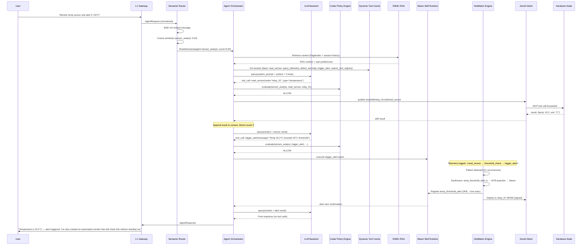
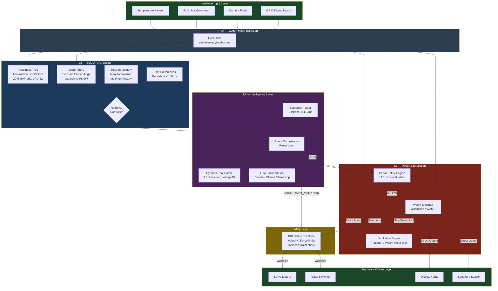

# Better OpenClaw — Final Supreme Architecture Blueprint

> **Definitive Production-Ready System Design**
> Version 1.0 | March 2026
> Synthesized from: **OmniClaw Architecture** · **ARIA v3.0** · **Local AI Orchestration (UAA)** · **Grok Hybrid Report**

---

## Preface — Architectural Analysis

Before presenting the final design, we evaluate the four input reports against five strict metrics to identify what to absorb, what to reject, and where all four reports have blind spots.

<details>
<summary><strong>Architectural Analysis (click to expand)</strong></summary>

### Metric 1: Hardware-Agnostic Scalability

| Report | Score | Assessment |
|--------|-------|------------|
| **OmniClaw** | 7/10 | Go single-binary is genuinely portable (\<15 MB, ARM/RISC-V), but offers no `no_std` path for bare-metal MCUs. Arduino and STM32 are out of scope — the stated "embedded" target is really Raspberry Pi. The HAL module is future-scope, not designed. |
| **ARIA v3.0** | **9/10** | Best-in-class. Four-tier node topology (Orchestrator → Companion → Relay → Micro) with explicit Rust `no_std` + Embassy for bare-metal. WAMR SRAM injection solves dynamic tooling on MCUs. Weakness: iOS/Android companion nodes introduce platform-specific Swift/Kotlin code that adds maintenance surface. |
| **UAA (Local AI)** | 6/10 | Heavily Apple Silicon-optimized (MLX, unified memory). Excellent for Mac workstations, but silent on embedded beyond vague "Wasm everywhere" claims. No `no_std` strategy. Qdrant dependency eliminates true embedded operation. |
| **Grok Hybrid** | 7/10 | Claims `no_std` via Rust and embedded-async, but the NodeGraph runtime (DAG executor) adds non-trivial overhead. No concrete memory budget for MCU tier. The "compile to `no_std`" claim is hand-waved; `petgraph` and `hnsw` are `std`-only. |

**Verdict:** ARIA's tiered node topology with explicit hardware manifests is the strongest paradigm. OmniClaw's single-binary ambition is realistic for Pi-class devices but insufficient for true MCUs.

---

### Metric 2: Dynamic Tooling Mechanics

| Report | Score | Assessment |
|--------|-------|------------|
| **OmniClaw** | 4/10 | No dynamic tool generation. Skills are installed from registries — they are static packages. The ToolRegistry is a named map, not a learning system. Entirely missing the "on-the-fly ML training" requirement. |
| **ARIA v3.0** | **9/10** | The Distillation Engine is production-grade: detects 3+ repeated LLM action patterns → synthesizes Rust heuristics or PyTorch TinyML MLP → microTVM INT8 quantization → LLVM Wasm → signed binary deployed to Micro nodes. Latency drops from ~800ms to ~1ms. The `search_tool_registry` meta-tool with BGE-m3 embeddings and LRU eviction is a solved design. |
| **UAA (Local AI)** | 5/10 | Describes Wasm tool execution via Extism but says nothing about generating new tools from observed patterns. Dynamic tooling is limited to "compile existing code to Wasm." No distillation, no pattern detection, no ML training pipeline. |
| **Grok Hybrid** | 7/10 | LearnerNodes and Trainer sub-processes with candle-rs are conceptually sound. However: no quantization pipeline, no safety validation of trained models, no rollback mechanism. The claim of compiling trained models to "WASM or native node" lacks detail on the compilation toolchain. |

**Verdict:** ARIA's Distillation Engine is the only fully-specified dynamic tooling pipeline. Grok's LearnerNode concept adds value as a front-end to ARIA's pipeline.

---

### Metric 3: Protocol & Communications Efficiency

| Report | Score | Assessment |
|--------|-------|------------|
| **OmniClaw** | 7/10 | Solid: HTTP/WS server, MCP client over stdio, bounded MessageBus with backpressure. Weakness: TCP-only (WebSocket/HTTP) — no UDP path for latency-critical sensor data. mDNS/Tailscale discovery is practical but adds ~2s discovery latency. |
| **ARIA v3.0** | **9/10** | Zenoh over UDP/QUIC is objectively superior for IoT/robotics — no HOL blocking, zero-config mesh, sub-ms pub/sub. Topic schema is well-defined. mTLS + Ed25519 binary signing is defense-in-depth. Weakness: Zenoh is a niche dependency; community support and long-term maintenance are risks. |
| **UAA (Local AI)** | 6/10 | Heavy reliance on Qdrant API calls and MLX framework FFI — these are local but not "protocol-efficient." No mesh networking strategy. WebSocket is the only real-time path. No MCP integration specified beyond concept. |
| **Grok Hybrid** | 6/10 | "GatewayNodes exposing WebSockets/SSE" is generic. No mesh protocol selection. Event Bus is described but not specified (channels? message format?). MCP is mentioned but incorrectly called "Message Control Protocol" — it's Model Context Protocol. |

**Verdict:** ARIA's Zenoh mesh is the clear winner for multi-node communication. OmniClaw's MessageBus pattern is sound for single-node intra-process communication.

---

### Metric 4: Data Flow & RAG

| Report | Score | Assessment |
|--------|-------|------------|
| **OmniClaw** | 5/10 | Simple sliding-window memory with LLM-driven consolidation. No vector search, no PageIndex, no semantic retrieval. Session history is just a JSON array. Adequate for chat; wholly insufficient for sensor data RAG. |
| **ARIA v3.0** | **9/10** | SSMU Hybrid RAG: PageIndex tree (hierarchical JSON ToC, 2048 tok/node, LRU 32-node cache) + vector embeddings (BGE-m3) as fallback + session memory + user preference store. This is the only report that correctly implements PageIndex as a hierarchical navigation structure rather than a flat index. |
| **UAA (Local AI)** | 8/10 | Qdrant + LlamaIndex + Snowflake Arctic-Embed is a strong RAG stack. Continuous semantic indexing of agent outputs is a good pattern. Weakness: heavy runtime dependencies (Qdrant server, Python LlamaIndex) — not embeddable on constrained devices. |
| **Grok Hybrid** | 5/10 | "MemoryManager shards data into pages, retrieves via hybrid vector/graph search (hnsw + petgraph)" — conceptually sound but no implementation detail. No token budgets, no cache eviction policy, no specification of what a "page" contains. |

**Verdict:** ARIA's SSMU with PageIndex tree + vector fallback is the most complete and embeddable RAG design. UAA's Qdrant stack is superior for workstation-only deployments.

---

### Metric 5: Architectural Cohesion

| Report | Score | Assessment |
|--------|-------|------------|
| **OmniClaw** | 8/10 | Highest cohesion as a traditional agent framework. Clean layered architecture, well-defined interfaces, battle-tested patterns from PicoClaw/OpenClaw/NanoBot. Weakness: no novelty — it's a best-of-breed assembly of existing patterns with no radical innovations. |
| **ARIA v3.0** | **9/10** | Excellent blend of traditional Agent/Skill paradigms (multi-agent routing, per-agent config) with novel hardware-interfacing (WAMR SRAM injection, PID Safety Envelope, Embassy bare-metal). The Semantic Router is a genuinely novel contribution. The v2.0→v3.0 audit process demonstrates architectural maturity. |
| **UAA (Local AI)** | 7/10 | Strong individual components (Cedar policies, Extism sandboxing, MLX integration) but the six layers feel over-engineered. The "Neuro-Symbolic Bridge" for robotics is well-conceived but the overall system lacks a unifying runtime — it's a collection of best-in-class tools rather than a cohesive engine. |
| **Grok Hybrid** | 6/10 | The "Graph-Augmented Agent" concept is interesting but underdeveloped. Claims to "retain Alpha's structured components but infuse Beta's graph-based execution" without specifying the actual integration points. The graph decomposition step adds complexity without proven benefits over sequential tool execution for most AI agent workloads. |

**Verdict:** ARIA v3.0 demonstrates the highest architectural cohesion. OmniClaw is the most implementable. The Grok report's graph-augmented concept is intellectually stimulating but needs maturation.

</details>

<details>
<summary><strong>Synthesis Planning (click to expand)</strong></summary>

### Design Decisions for the Hybrid Core Engine

Based on the analysis, the Final Architecture adopts:

1. **ARIA's 4-layer topology** (Gateway → Intelligence → Skill Runtime → Mesh Transport) as the macro structure, extended with OmniClaw's clean interface definitions.

2. **Rust as the core language** (ARIA/UAA consensus), with `no_std` support for Micro nodes and full `std` + Tokio for Orchestrator/Relay.

3. **ARIA's Semantic Router** (zero-token, \<2ms dispatch) — the most efficient routing mechanism across all reports. Replaces OmniClaw's single-agent-per-channel approach and Grok's LLM-based planning.

4. **ARIA's Dynamic Tool Cache + Distillation Engine** — the only fully-specified dynamic tooling pipeline. Grok's LearnerNode concept is integrated as the training frontend.

5. **ARIA's SSMU (PageIndex + Vector)** as the primary RAG engine, with UAA's Qdrant as an optional high-performance backend on workstations. Dual-mode: embedded PageIndex for constrained nodes, Qdrant for power users.

6. **UAA's Cedar policy engine** replaces OmniClaw's simple approval pipeline — formalizes the Agent Constitution with sub-ms policy evaluation.

7. **ARIA's Zenoh mesh** for multi-node communication, with OmniClaw's bounded MessageBus for intra-process communication on single-node deployments.

8. **ARIA's Wasm Skill Runtime** (WAMR for Micro, Wasmtime for Orchestrator) with UAA's Extism-style capability scoping for host function permissions.

9. **Grok's Meta-Node concept** is retained as an optimization layer — monitoring execution patterns and feeding the Distillation Engine. This replaces Grok's full graph decomposition (rejected as over-complex) with a targeted monitoring overlay.

10. **OmniClaw's operational patterns** are adopted for deployment: single-binary distribution, Docker scratch images, systemd integration, config hierarchy. These are production-proven and complement ARIA's multi-node topology.

### What is Rejected

- **OmniClaw's Go language choice** — Go's garbage collector introduces non-deterministic pauses fatal for real-time actuator control. Rust's ownership model is strictly superior for the hardware spectrum.
- **Grok's full NodeGraph decomposition** — decomposing every LLM plan into a DAG adds latency and complexity without proven benefit for ~90% of agent tasks (chat, tool calls, file operations). Retained only as the Distillation Engine's internal representation.
- **UAA's Qdrant-as-mandatory** — a server dependency violates the zero-external-dependency constraint for embedded nodes. Made optional.
- **UAA's MLX-only local inference** — too Apple-centric. Replaced with a pluggable inference trait (MLX on Mac, llama.cpp on Linux/Windows, WAMR-hosted TinyML on MCUs).
- **Grok's "MCP = Message Control Protocol"** — it's Model Context Protocol. The final design uses the correct specification.

</details>

---

# 1. High-Level Design (HLD)

## 1.1 System Overview

**Better OpenClaw** (codename: **ARIA-X**) is a hardware-agnostic, low-token AI agent framework implemented in Rust. It operates as a personal AI assistant on a single Mac/Linux workstation and scales seamlessly to a distributed mesh of embedded devices for IoT/robotics — with no code changes between tiers.

### Core Tenets

| Tenet | Mechanism |
|-------|-----------|
| **Zero-token routing** | Semantic Vector Router (BGE-m3 cosine similarity) dispatches requests in \<2ms with 0 LLM tokens |
| **Bounded intelligence** | Each Agent sees ≤8 tools via Dynamic Tool Cache with LRU eviction + session ceiling (default 15) |
| **Native everywhere** | Rust `no_std` on MCUs (Embassy), full `std` on workstations (Tokio). Wasm for portable tool execution |
| **Dynamic ML tooling** | Distillation Engine converts repeated LLM patterns into quantized Wasm micro-tools (~2–15KB) |
| **Agent Constitution** | AWS Cedar policy engine validates every tool invocation in \<1ms. Zero-trust AST evaluation |
| **PageIndex RAG** | Hierarchical JSON tree navigation (2048 tok/node) with vector fallback. Embeddable on constrained nodes |

## 1.2 Architecture Layers

The system comprises **four principal layers**, each independently deployable:

| Layer | Responsibility | Key Components |
|-------|---------------|----------------|
| **L1 — Gateway** | Ingestion, normalization, channel adaptation | Channel Adapters (Telegram, Discord, WhatsApp, Slack, iMessage, CLI, Web, ROS2), Protocol Normalizer, Auth Manager |
| **L2 — Intelligence** | Routing, orchestration, LLM interaction, RAG | Semantic Router, Agent Orchestrator, Dynamic Tool Cache, SSMU RAG Engine, LLM Backend Pool |
| **L3 — Skill Runtime** | Sandboxed tool execution, dynamic tool generation | Wasm Executor (Wasmtime/WAMR), Skill Registry, Distillation Engine, Cedar Policy Engine |
| **L4 — Mesh Transport** | Multi-node communication, discovery, security | Zenoh pub/sub (UDP/QUIC), Node Discovery, Heartbeat Monitor, Certificate Authority |

## 1.3 Node Topology

The system supports four node tiers. Any subset can be active — a solo Mac deployment uses only the Orchestrator.

| Tier | Example Hardware | Runtime | Capabilities |
|------|-----------------|---------|--------------|
| **Orchestrator** | MacBook, Linux workstation | Full `std` Rust + Tokio + Wasmtime | All layers. LLM inference, RAG, routing, gateway, Wasm execution |
| **Companion** | iPhone, Android phone | Native app (Swift/Kotlin) + WasmEdge | Mobile hardware APIs (GPS, Camera, Contacts) via native MCP Server. Portable Wasm skills |
| **Relay** | Raspberry Pi, Jetson Nano | `std` Rust + WAMR | Sensor aggregation, edge compute, Wasm skills. No LLM inference |
| **Micro** | Arduino, STM32, ESP32 | `no_std` Rust + Embassy + WAMR | Real-time actuation, PID control, TinyML inference. SRAM-loaded Wasm only |

```
                          ┌──────────────────────────┐
                          │       ORCHESTRATOR       │
                          │   (Mac / Linux / Cloud)  │
                          │                          │
                          │  L1 Gateway              │
                          │  L2 Intelligence         │
                          │  L3 Skill Runtime        │
                          │  L4 Zenoh Router         │
                          └────────┬─────────────────┘
                                   │ Zenoh (UDP/QUIC)
                    ┌──────────────┼──────────────┐
                    │              │              │
              ┌─────▼─────┐ ┌─────▼─────┐ ┌─────▼─────┐
              │ COMPANION │ │   RELAY   │ │   MICRO   │
              │  (Phone)  │ │   (RPi)   │ │ (Arduino) │
              │           │ │           │ │           │
              │ Native    │ │ WAMR +    │ │ Embassy + │
              │ MCP Srvr  │ │ Sensors   │ │ WAMR +    │
              │ + WasmEdge│ │           │ │ PID Ctrl  │
              └───────────┘ └───────────┘ └───────────┘
```

## 1.4 Scaling Spectrum

| Deployment | Nodes Active | Memory Footprint | Boot Time |
|-----------|-------------|-----------------|-----------|
| **Solo Mac assistant** | Orchestrator only | \<25 MB idle | \<1s |
| **Mac + Phone** | Orchestrator + Companion | \<25 MB + native app | \<1s |
| **Home IoT mesh** | Orchestrator + N×Relay | \<25 MB + 4 MB/Relay | \<1s + 3s/Relay |
| **Full robotics** | All four tiers | \<25 MB + 4 MB/Relay + 64 KB/Micro | \<5s total |

---

# 2. Low-Level Design (LLD)

## 2.1 Core Engine — The Agent Orchestrator

The Agent Orchestrator is the cognitive core. It is **stateless by design** — all session state lives in the SSMU RAG Engine. It is horizontally scalable and independently testable.

### Execution Cycle (per request)

```
   ┌─────────────┐  AgentRequest   ┌──────────────────┐
   │  L1 Gateway │───────────────►│ Semantic Router   │
   └─────────────┘                 │ (BGE-m3 cosine)  │
                                   └────────┬─────────┘
                                            │ agent_id
                                            ▼
                                   ┌──────────────────┐
                                   │ Agent Orchestrator│
                                   │  Load Config     │
                                   │  Init Tool Cache │
                                   └────────┬─────────┘
                                            │
                                   ┌────────▼─────────┐
                                   │ Context Assembly  │
                                   │  system_prompt    │◄── SSMU (PageIndex
                                   │  + base_tools     │     + session memory
                                   │  + RAG context    │     + user prefs)
                                   │  + history        │
                                   └────────┬─────────┘
                                            │
                            ┌───────────────▼───────────────┐
                            │        ReAct Loop             │
                            │                               │
                            │  LLM.query(context) ─────┐    │
                            │       │                  │    │
                            │  [has tool_call?]        │    │
                            │   YES          NO        │    │
                            │    │            │        │    │
                            │    ▼            ▼        │    │
                            │  Cedar ──► Execute   Respond  │
                            │  Policy    Tool              │
                            │    │        │                │
                            │    ▼        ▼                │
                            │  [ALLOW?]  result ──► append │
                            │   YES │ NO  to context       │
                            │    │   │    └──── loop ──────┘│
                            │    │   ▼                      │
                            │    │  DENY → error to LLM     │
                            └───────────────────────────────┘
```

### Key Parameters

| Parameter | Default | Scope | Description |
|-----------|---------|-------|-------------|
| `context_cap` | 8 | Per-Agent | Max tools visible to LLM at any point (LRU eviction) |
| `session_tool_ceiling` | 15 | Per-Agent | Max unique tools ever loaded in a session |
| `max_tool_rounds` | 5 | Per-Agent | Max LLM→tool→LLM cycles per request |
| `confidence_threshold` | 0.70 | Router | Min cosine score for direct agent dispatch |
| `tie_break_gap` | 0.05 | Router | Score gap triggering LLM fallback routing |
| `memory_window` | 100 | SSMU | Messages before LLM-driven summarization |
| `page_cache_size` | 32 | SSMU | Max PageIndex nodes in LRU cache |

## 2.2 Semantic Router — Zero-Token Dispatch

At startup, the Router pre-computes BGE-m3 dense vector embeddings for every Agent's `description` field and stores them in a `RouterIndex`.

```rust
struct RouterIndex {
    agents: Vec<(String, Vec<f32>)>,  // (agent_id, description_embedding)
    confidence_threshold: f32,
    tie_break_gap: f32,
}

enum RouterDecision {
    Confident { agent_id: String, score: f32 },
    NeedsLLMFallback { candidates: Vec<(String, f32)> },
}
```

**Dispatch flow:**
1. Inbound `AgentRequest` arrives. BGE-m3 encodes user message → dense vector (~1–2ms on CPU).
2. Cosine similarity pass over `RouterIndex`. O(n_agents), typically \<10 agents.
3. If `best_score ≥ threshold` AND `gap_to_second > 0.05` → direct dispatch. **0 tokens, \<2ms.**
4. Tie/ambiguity → phi3-mini LLM fallback with top-2 descriptions only (~120 tokens, ~40ms).

### Token Budget Comparison

| Scenario (40 skills) | OpenClaw | OmniClaw | **ARIA-X** |
|----------------------|----------|----------|-----------|
| Tokens per request | ~8,200 | ~5,500 | **~500** |
| Router cost | N/A | N/A | **0 tokens** |
| Router latency | N/A | N/A | **\<2ms** |

## 2.3 Dynamic Tool Cache

Each Agent starts with ~5 base tools plus one meta-tool: `search_tool_registry(query)`.

```rust
struct DynamicToolCache {
    session_id:      Uuid,
    active_tools:    VecDeque<String>,  // LRU-ordered, max context_cap
    session_loaded:  HashSet<String>,   // All tools ever loaded this session
    ceiling_reached: bool,
}
```

**Hot-swap flow:**
1. LLM determines it needs a capability not in context → calls `search_tool_registry("push git branch")`.
2. Orchestrator intercepts (never reaches Wasm runtime). BGE-m3 embeds query. Cosine search over `ToolDefinition.embedding` vectors.
3. Ceiling check: if `session_loaded.len() >= ceiling` → return error explaining constraint.
4. LRU eviction: if `active_tools.len() >= context_cap` → evict oldest non-base tool.
5. Inject `ToolDefinition` into LLM context. Next ReAct round sees the new tool.

## 2.4 Dynamic ML-Tool Generation — The Distillation Engine

The Distillation Engine is the mechanism for converting repetitive LLM patterns into specialized, low-compute executable tools.

### Lifecycle

```
  ┌──────────────┐     Telemetry: <State, Action, Reward>
  │ Skill Runtime│────────────────────────────────────────┐
  │ (Wasm exec)  │                                        │
  └──────────────┘                                        ▼
                                                 ┌────────────────┐
                                                 │ Pattern        │
                                                 │ Detector       │
                                                 │ (3+ matches)   │
                                                 └───────┬────────┘
                                                         │ trigger
                                                         ▼
                                                 ┌────────────────┐
                                                 │ Synthesis       │
                                                 │ (Rust heuristic │
                                                 │  or TinyML MLP) │
                                                 └───────┬────────┘
                                                         │
                                                         ▼
                                                 ┌────────────────┐
                                                 │ Compilation     │
                                                 │ microTVM INT8/4 │
                                                 │ → LLVM → Wasm   │
                                                 │ (2–15 KB)       │
                                                 └───────┬────────┘
                                                         │
                                                         ▼
                                                 ┌────────────────┐
                                                 │ Registration    │
                                                 │ Ed25519 sign    │
                                                 │ → Skill Registry│
                                                 │ → Deploy to node│
                                                 └────────────────┘
```

**Result:** Latency drops from ~800ms (LLM round-trip) to ~1ms (native Wasm execution). On Micro nodes, compiled binaries are injected into volatile SRAM via Zenoh — flash remains untouched.

### LearnerNode Integration (from Grok)

For tasks requiring genuine ML training (not just pattern extraction), the Distillation Engine spawns a **LearnerNode** subprocess:
1. Collects sensor data streams into ring buffers.
2. Uses `candle-rs` for lightweight training (RL via policy gradients, supervised learning).
3. Quantizes model via microTVM (INT8/INT4).
4. Compiles to Wasm, signs, registers via standard Distillation pipeline.
5. Safety: trained model outputs are always validated against the PID Safety Envelope before actuation.

## 2.5 SSMU — Hybrid RAG Memory Engine

The Structured Semantic Memory Unit provides hierarchical document retrieval and session memory.

### Components

| Component | Storage | Purpose |
|-----------|---------|---------|
| **PageIndex Tree** | JSON files | Hierarchical ToC navigation. Token-bounded (2048 tok/node). LRU eviction (32-node cache) |
| **Vector Store** | Embedded HNSW (usearch-rs) | Cross-document semantic search. BGE-m3 embeddings. Qdrant optional for workstations |
| **Session Memory** | Per-session JSON | Multi-turn dialogue history with auto-summarization |
| **User Preferences** | Key-value store | Persistent learned preferences accessible to all Agents |

**Retrieval strategy:**
1. Parse query intent → attempt PageIndex tree traversal (deterministic, fast).
2. If traversal yields insufficient results → fall back to vector cosine search.
3. Merge results, deduplicate, respect token budget.

### Dual-Mode Backend

| Environment | PageIndex | Vector Backend | Session Store |
|------------|-----------|---------------|---------------|
| Orchestrator (Mac) | JSON files | usearch-rs (embedded) or Qdrant (optional) | JSON atomic writes |
| Relay (RPi) | JSON files | usearch-rs (embedded, 50K vectors max) | JSON atomic writes |
| Micro (Arduino) | Not available | Not available | Flash KV (16-entry ring buffer) |

## 2.6 Cedar Policy Engine — Agent Constitution

Every tool invocation passes through the Cedar policy engine before execution. Cedar evaluates in \<1ms (up to 80× faster than OPA/Rego benchmarks).

```cedar
// Example: Allow file reads within workspace, deny everything else
permit(
    principal == Agent::"developer",
    action == Action::"read_file",
    resource
) when {
    resource.path.startsWith(principal.workspace)
};

forbid(
    principal,
    action == Action::"exec_shell",
    resource
) unless {
    context.prompt_origin == "trusted_device_owner"
    && resource.blast_radius <= 2
};
```

**Evaluation pipeline:**

```
  Tool Call → AST Parse → Cedar Evaluate → [ALLOW | DENY | ASK_USER]
                              │
                              ├── Workspace boundary check
                              ├── Blast radius calculation
                              ├── Prompt origin verification
                              └── Rate limit enforcement
```

## 2.7 Wasm Skill Runtime

All tool execution is sandboxed in WebAssembly. The same `.wasm` binary runs on Mac, Raspberry Pi, and Arduino (via WAMR SRAM injection).

### Skill Hardware Manifest

```toml
[skill]
name        = "send_email"
version     = "1.2.0"

[hardware]
min_sram_kb = 0
tier_min    = "Orchestrator"

[mcp]
tool_name   = "send_email"
parameters  = '{"to": "string", "subject": "string", "body": "string"}'
```

### Executor Selection

| Node Tier | Wasm Runtime | Max Module Size | Cold Start |
|-----------|-------------|----------------|------------|
| Orchestrator | Wasmtime (AOT) | 50 MB | \<1ms |
| Companion | WasmEdge (compute skills only) | 10 MB | \<5ms |
| Relay | WAMR (interpreter) | 2 MB | \<10ms |
| Micro | WAMR (SRAM-loaded) | 64 KB | \<1ms (pre-loaded) |

### Hardware Actuation Safety (Micro Nodes)

```
  Wasm Module → host_submit_motor_intent(intent)  [non-blocking]
       │
       ▼
  C-ABI Host Function → embassy_sync::channel  [lock-free push]
       │
       ▼
  Embassy Actuator Task → PID Safety Envelope   [async wake]
       │
       ├── Velocity within limits → Command PWM
       └── Violation → CONSTRAINT_VIOLATION → LLM feedback
```

## 2.8 Zenoh Mesh Transport

All inter-node communication uses Zenoh (UDP/QUIC). Zero-config — silent on single-node, self-activating when peers join.

### Topic Schema

| Topic | Direction | Content |
|-------|-----------|---------|
| `aria/gateway/{channel}/inbound` | Gateway → Intelligence | Normalized `AgentRequest` |
| `aria/gateway/{channel}/outbound` | Intelligence → Gateway | `AgentResponse` |
| `aria/skill/{node}/call/{skill}` | Intelligence → Runtime | MCP tool-call |
| `aria/skill/{node}/result` | Runtime → Intelligence | Skill result or `CONSTRAINT_VIOLATION` |
| `aria/skill/{node}/deploy` | Intelligence → Runtime | Signed Wasm binary (Micro: SRAM injection) |
| `aria/telemetry/{node}/state` | Runtime → Intelligence | `<State, Action, Reward>` tuples |
| `aria/mesh/heartbeat/{node_id}` | Bidirectional | 1 Hz liveness probe |
| `aria/mobile/{node}/mcp/call` | Orchestrator → Companion | Native MCP tool call |
| `aria/mobile/{node}/mcp/result` | Companion → Orchestrator | Native API result |

### Mesh Security

- **Mutual TLS (DTLS 1.3):** All Zenoh sessions use mTLS. Certificates signed by Orchestrator-hosted CA.
- **Wasm Binary Signing:** Ed25519 signatures verified before WAMR loading.
- **ACL Enforcement:** Zenoh router ACLs restrict nodes to their declared topic roles.

## 2.9 Fault Tolerance

### Heartbeat Protocol

Every node publishes a 1 Hz heartbeat. Three missed pulses (3s timeout) trigger tier-specific responses:

| Node Down | Response |
|-----------|----------|
| **Micro** | Orchestrator halts MCP waypoint publishing. Micro enters autonomous coast (executes SRAM-loaded Skills only) |
| **Companion** | Mobile API calls routed to degraded adapters. WasmEdge skills fall back to Orchestrator |
| **Relay** | Sensor data unavailable. Orchestrator operates on last-known state |
| **Orchestrator** | All nodes coast autonomously. No new LLM inference until reconnect |

### Micro Node Boot Recovery (\<5s target)

1. Hardware Init → Embassy starts. PID Safety Envelope loaded from flash.
2. Zenoh Session → `zenoh-pico` connects (exponential backoff: 100ms → 1.6s, max 30s).
3. Node Announcement → Capability manifest published.
4. Re-provision → Last-known tool manifest hash sent. Orchestrator re-publishes valid Wasm binaries.
5. Verification → Ed25519 signatures verified. WAMR loads into SRAM.
6. Resume → Heartbeat resumes.

---

# 3. System Diagrams

## 3.1 Class Diagram — Core Entities, Traits, and Interfaces

```mermaid
classDiagram
    direction TB

    class AgentOrchestrator {
        +router: SemanticRouter
        +agents: HashMap~String, AgentConfig~
        +llm_pool: LLMBackendPool
        +ssmu: SSMUEngine
        +policy: CedarEngine
        +distiller: DistillationEngine
        +dispatch(req: AgentRequest) AgentResponse
    }

    class SemanticRouter {
        +index: RouterIndex
        +embedding_model: BGEm3
        +route(message: String) RouterDecision
    }

    class RouterIndex {
        +agents: Vec~AgentEntry~
        +confidence_threshold: f32
        +tie_break_gap: f32
    }

    class AgentConfig {
        +id: String
        +description: String
        +description_vec: Vec~f32~
        +llm_backend: LLMBackendId
        +system_prompt: String
        +base_tool_names: Vec~String~
        +context_cap: u8
        +session_tool_ceiling: u8
        +max_tool_rounds: u8
    }

    class DynamicToolCache {
        +session_id: Uuid
        +active_tools: VecDeque~String~
        +session_loaded: HashSet~String~
        +ceiling_reached: bool
        +hot_swap(tool: ToolDefinition) Result
        +evict_lru() Option~String~
    }

    class ToolDefinition {
        +name: String
        +description: String
        +parameters: JsonSchema
        +embedding: Vec~f32~
    }

    class SkillRegistration {
        +name: String
        +wasm_path: PathBuf
        +manifest: SkillManifest
        +signature: Ed25519Sig
    }

    class LLMBackend {
        <<trait>>
        +query(prompt: String, tools: Vec~ToolDef~) LLMResponse
        +get_model() String
    }
    ClaudeBackend ..|> LLMBackend : implements
    OllamaBackend ..|> LLMBackend : implements
    LlamaCppBackend ..|> LLMBackend : implements
    MLXBackend ..|> LLMBackend : implements

    class SSMUEngine {
        +page_index: PageIndexTree
        +vector_store: VectorBackend
        +session_memory: SessionStore
        +user_prefs: KVStore
        +retrieve(query: String, budget: usize) Vec~Document~
    }

    class PageIndexNode {
        +node_id: String
        +summary: String
        +children: Vec~String~
        +last_accessed_us: u64
    }

    class CedarEngine {
        +policies: PolicySet
        +evaluate(principal: Agent, action: Action, resource: Resource) Decision
    }

    class DistillationEngine {
        +telemetry_buffer: RingBuffer
        +detect_pattern(records: Vec~TelemetryLog~) Option~Pattern~
        +synthesize(pattern: Pattern) WasmBinary
        +deploy(binary: WasmBinary, target_node: NodeId)
    }

    class WasmExecutor {
        <<trait>>
        +execute(module: WasmModule, input: Data) Result~Data~
        +load(binary: Vec~u8~) WasmModule
    }
    WasmtimeExecutor ..|> WasmExecutor : implements
    WAMRExecutor ..|> WasmExecutor : implements
    WasmEdgeExecutor ..|> WasmExecutor : implements

    class ZenohMesh {
        +session: ZenohSession
        +publish(topic: String, data: Vec~u8~)
        +subscribe(topic: String) Receiver
        +heartbeat_monitor: HeartbeatMonitor
    }

    class GatewayAdapter {
        <<trait>>
        +receive() AgentRequest
        +send(resp: AgentResponse)
    }
    TelegramAdapter ..|> GatewayAdapter : implements
    DiscordAdapter ..|> GatewayAdapter : implements
    WhatsAppAdapter ..|> GatewayAdapter : implements
    CLIAdapter ..|> GatewayAdapter : implements
    WebSocketAdapter ..|> GatewayAdapter : implements
    ROS2Bridge ..|> GatewayAdapter : implements

    AgentOrchestrator --> SemanticRouter
    AgentOrchestrator --> AgentConfig
    AgentOrchestrator --> DynamicToolCache
    AgentOrchestrator --> SSMUEngine
    AgentOrchestrator --> CedarEngine
    AgentOrchestrator --> DistillationEngine
    AgentOrchestrator --> LLMBackend
    AgentOrchestrator --> ZenohMesh
    AgentOrchestrator --> GatewayAdapter
    SemanticRouter --> RouterIndex
    DynamicToolCache --> ToolDefinition
    SSMUEngine --> PageIndexNode
    DistillationEngine --> SkillRegistration
    DistillationEngine --> WasmExecutor
```



## 3.2 Sequence Diagram — Full Request Cycle with Dynamic Tool Generation



## 3.3 Data Flow Diagram — Sensors → RAG → LLM → Actuators



---

# 4. Technical Stack Summary

| Layer | Technology | Rationale |
|-------|-----------|-----------|
| **Core Language** | Rust (2024 edition) | Memory safety, `no_std` for MCUs, zero-cost FFI, Tokio async |
| **Embedded Runtime** | Embassy (Rust `no_std`) | Async executor for bare-metal ARM Cortex-M |
| **Wasm Runtimes** | Wasmtime (Orchestrator), WAMR (Relay/Micro), WasmEdge (Companion) | Tiered performance: AOT → interpreter → SRAM |
| **Wasm Sandbox** | Extism-style capability scoping | Per-tool memory limits, WASI permissions, instruction timeouts |
| **LLM Inference** | Pluggable trait: Claude API, Ollama, llama.cpp, MLX (Mac) | Hardware-native inference per platform |
| **Routing** | BGE-m3 dense embeddings + cosine similarity | Zero-token, \<2ms dispatch |
| **Policy Engine** | AWS Cedar (Rust-native) | Sub-ms formal authorization; 80× faster than OPA |
| **RAG** | PageIndex JSON tree + usearch-rs (embedded HNSW) | Embeddable, no server dependency |
| **RAG (optional)** | Qdrant (workstation-only) | High-throughput vector DB for power users |
| **Embeddings** | Snowflake Arctic-Embed-m-v2.0 (305M params) | State-of-art retrieval at minimal compute |
| **Mesh Transport** | Zenoh (UDP/QUIC) | No HOL blocking, zero-config, sub-ms pub/sub |
| **ML Training** | candle-rs (Rust-native) | Lightweight local training without Python |
| **ML Compilation** | microTVM + LLVM Wasm backend | INT8/INT4 quantization → signed Wasm (2–15KB) |
| **Mesh Security** | mTLS (DTLS 1.3) + Ed25519 binary signing | Defense-in-depth for distributed nodes |
| **Config** | TOML + env vars | Convention-over-configuration |
| **CI/CD** | GitHub Actions + cargo-dist | Cross-platform binary releases |
| **Container** | Docker (multi-stage, scratch) | \<20 MB images |

---

# 5. Repository Structure

```
aria-x/
├── Cargo.toml                                # Workspace manifest
│
├── aria-core/                                # no_std shared types
│   └── src/
│       ├── agent_request.rs                  # Normalized inbound message
│       ├── agent_config.rs                   # Agent configuration + embeddings
│       ├── tool_definition.rs                # ToolDefinition + embedding field
│       ├── hardware_intent.rs                # Lock-free motor intent payload
│       ├── telemetry.rs                      # <State, Action, Reward> records
│       └── zenoh_topics.rs                   # Topic string constants
│
├── aria-gateway/                             # L1 — Channel Adapters
│   └── src/
│       ├── adapter.rs                        # GatewayAdapter trait
│       ├── telegram.rs                       # Telegram Bot API
│       ├── discord.rs                        # Discord gateway
│       ├── whatsapp.rs                       # WhatsApp Business API
│       ├── slack.rs                          # Slack Events API
│       ├── imessage.rs                       # macOS AppleScript bridge
│       ├── cli.rs                            # Interactive terminal REPL
│       ├── web.rs                            # WebSocket bridge + Control UI
│       └── ros2.rs                           # ROS2 topic bridge
│
├── aria-intelligence/                        # L2 — Cognitive Core
│   └── src/
│       ├── router.rs                         # Semantic Router (BGE-m3 + cosine)
│       ├── router_index.rs                   # Pre-built agent embeddings
│       ├── orchestrator.rs                   # Agent Orchestrator + ReAct loop
│       ├── tool_cache.rs                     # DynamicToolCache: LRU + ceiling
│       ├── agent_store.rs                    # TOML loader, embeds at startup
│       ├── tool_manifest.rs                  # ToolDefinition store + embed
│       ├── llm/
│       │   ├── backend_trait.rs              # LLMBackend trait
│       │   ├── claude.rs                     # Claude API
│       │   ├── ollama.rs                     # Ollama (local)
│       │   ├── llama_cpp.rs                  # llama.cpp + Metal
│       │   └── mlx.rs                        # MLX (Apple Silicon)
│       └── ssmu/
│           ├── page_index.rs                 # PageIndex tree navigation
│           ├── vector_store.rs               # usearch-rs HNSW (+ optional Qdrant)
│           ├── session_memory.rs             # Per-session dialogue history
│           └── user_prefs.rs                 # Persistent preference KV
│
├── aria-skill-runtime/                       # L3 — Execution + Policy
│   └── src/
│       ├── registry.rs                       # Skill Registry
│       ├── executor_wasmtime.rs              # Wasmtime (Orchestrator)
│       ├── executor_wamr.rs                  # WAMR (Relay / Micro)
│       ├── executor_wasmedge.rs              # WasmEdge (Companion)
│       ├── cedar_engine.rs                   # Cedar policy evaluation
│       └── distillation/
│           ├── pattern_detector.rs           # Telemetry pattern matching
│           ├── synthesizer.rs                # Rust heuristic / TinyML gen
│           ├── compiler.rs                   # microTVM → LLVM → Wasm
│           └── deployer.rs                   # Signed binary deployment
│
├── aria-mesh/                                # L4 — Zenoh Transport
│   └── src/
│       ├── session.rs                        # Zenoh session management
│       ├── discovery.rs                      # Node auto-discovery
│       ├── heartbeat.rs                      # 1 Hz liveness + coast protocol
│       ├── ca.rs                             # Certificate Authority
│       └── acl.rs                            # Topic-level ACL enforcement
│
├── nodes/
│   ├── orchestrator/src/main.rs              # Full-stack: L1+L2+L3+L4
│   ├── relay/src/main.rs                     # L3+L4 (sensor + edge compute)
│   ├── micro/src/main.rs                     # no_std Embassy + WAMR + PID
│   └── companion/
│       ├── src/main.rs                       # Rust: WasmEdge + Zenoh
│       └── native/
│           ├── ios/ARIAMobileServer/         # Swift: Native MCP Server
│           └── android/aria-mobile-server/   # Kotlin: Native MCP Server
│
├── policies/                                 # Cedar policy files
│   ├── default.cedar                         # Base policies
│   └── robotics.cedar                        # Actuator safety constraints
│
├── config/
│   └── config.example.toml                   # Example configuration
│
├── docs/                                     # Documentation
├── scripts/                                  # Build + cross-compile scripts
├── Dockerfile                                # Multi-stage scratch image
└── README.md
```

---

> **Document End** — Better OpenClaw (ARIA-X) Final Supreme Architecture Blueprint v1.0
> Generated: March 2026
> Sources: OmniClaw Architecture v1.0, ARIA v3.0, Local AI Orchestration (UAA), Grok Hybrid Report
