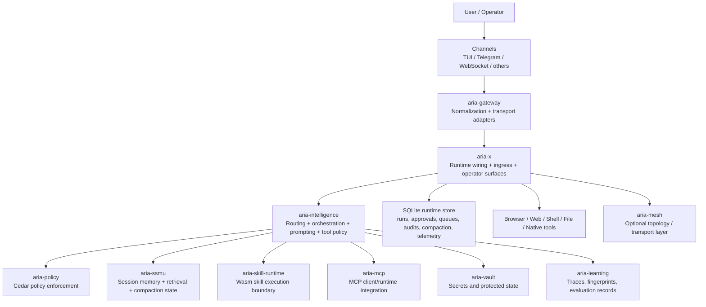
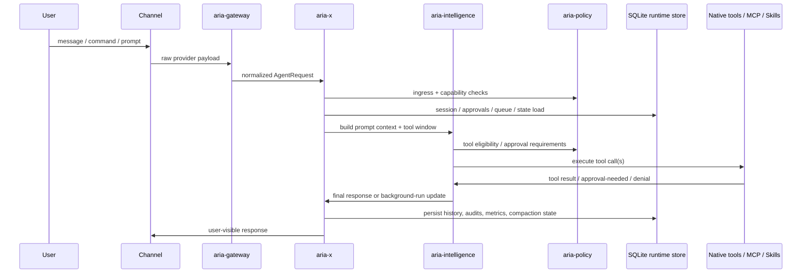
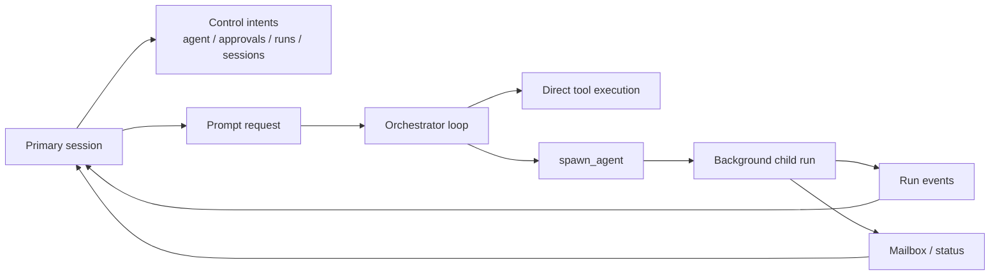

# ARIA-X/RoboClaw


ARIA-X is a local-first, multi-agent runtime and gateway platform written in Rust. It combines agent orchestration, policy enforcement, tool execution, retrieval, scheduling, browser automation, MCP integration, and multi-channel ingress into one cohesive system.

The project is designed around a practical constraint set:

- low-end-device-friendly by default
- SQLite-first for local and node deployments
- strict capability boundaries for agents, tools, files, retrieval, and delegation
- human-in-the-loop approvals for risky actions
- multi-channel operation without turning the core runtime into channel-specific code

> ARIA-X is not a chat wrapper. It is an agent runtime with durable state, explicit policy boundaries, tool orchestration, background jobs, and operator visibility.

## Table of Contents

- [What ARIA-X Is](#what-aria-x-is)
- [Current Platform Scope](#current-platform-scope)
- [Architecture](#architecture)
- [Runtime Flow](#runtime-flow)
- [Workspace Layout](#workspace-layout)
- [Key Capabilities](#key-capabilities)
- [Channels and Interaction Surfaces](#channels-and-interaction-surfaces)
- [Getting Started](#getting-started)
- [Configuration](#configuration)
- [Security Model](#security-model)
- [Docs Map](#docs-map)
- [Validation Status](#validation-status)
- [Known Boundaries](#known-boundaries)
- [Development](#development)
- [License](#license)

## What ARIA-X Is

ARIA-X is a Rust workspace for building and running:

- multi-agent systems with explicit capability profiles
- policy-gated tool execution
- local and remote channel adapters
- durable session memory and retrieval
- scheduled jobs and reminders
- browser-assisted web access and automation
- MCP client-side integration
- learning and audit traces for future self-improvement workflows

It is built as a modular workspace so the runtime can evolve without collapsing into one large binary with implicit behavior.

## Current Platform Scope

### Implemented baseline

- multi-agent runtime with agent overrides and scoped routing
- approval-gated file, shell, browser, and high-risk operations
- provider-aware LLM orchestration with capability-aware tool exposure
- durable session state, compaction state, approvals, runs, mailbox, audits, and runtime metrics in SQLite
- TUI interaction mode
- Telegram and WebSocket runtime support
- background runs, reminders, and scheduler flow
- browser profile/session state with encrypted persistence support
- MCP subsystem boundary and runtime integration
- skills/runtime foundation with policy gating

### Current maturity

- production-style architecture, alpha product stage
- core local/node runtime validated
- cluster-scale backend remains intentionally deferred

## Architecture

For the maintained multi-diagram reference set, see [`docs/architecture/README.md`](docs/architecture/README.md).

### High-level system view



### Request lifecycle



### Control and background execution model



## Runtime Flow

The current runtime path is:

1. Inbound payload is normalized into a common request shape.
2. Firewall and ingress safety checks run.
3. Session scoping and override resolution run.
4. Capability-aware tool exposure is computed for the active model and agent.
5. Retrieval builds a structured context pack from session state, control docs, and memory.
6. The orchestrator sends that context to the provider and runs the tool loop.
7. Approval-gated actions pause safely and persist approval state.
8. Responses, audits, queue state, metrics, and compaction state are persisted.
9. Outbound channel rendering sends the normalized response back to the originating surface.

## Workspace Layout

| Path | Purpose |
|---|---|
| `aria-core` | Shared contracts: requests, responses, agents, browser/tool/runtime types |
| `aria-gateway` | Channel adapters, normalization, transport-specific logic |
| `aria-intelligence` | Orchestrator, routing, prompting, provider adapters, tool policy |
| `aria-policy` | Cedar-backed policy and capability evaluation |
| `aria-ssmu` | Session state, retrieval, compaction, memory indexing |
| `aria-skill-runtime` | Wasm execution boundary for deterministic skills |
| `aria-mcp` | MCP client-side subsystem and runtime integration |
| `aria-learning` | Execution traces, fingerprints, evaluation/promotion records |
| `aria-safety` | Leak pattern scanning and safety utilities |
| `aria-vault` | Encrypted secret storage and protected state access |
| `aria-mesh` | Optional distributed topology / mesh transport layer |
| `aria-x` | Main binary: runtime composition, operator surfaces, TUI, scheduler |
| `agents/` | Agent capability profiles and role configuration |
| `nodes/` | Node-role configuration examples |
| `docs/` | Architecture, migration, audit, and planning documents |
| `scripts/` | Validation, stress, soak, and build helper scripts |

## Key Capabilities

### Agent runtime

- explicit agent selection and override support
- scoped delegation to child runs
- parent/child run graph and mailbox persistence
- bounded background execution
- capability ceilings enforced in code

### Tool execution

- provider-aware tool calling path
- approval-aware execution flow
- deterministic native-tool fast paths for critical operations
- runtime policy checks before file, shell, browser, retrieval, and MCP access
- tool exposure filtered by active model capabilities

### Browser and web access

- browser profile persistence
- default profile reuse
- login state and session persistence
- screenshot capture and browser action execution
- browser activity auditing

### Scheduling and background work

- reminders and recurring jobs
- durable scheduler state
- background child runs
- status and mailbox inspection

### Multi-channel support

- shared runtime with multiple adapters
- WebSocket channel for structured local and remote clients
- Telegram integration
- TUI client over the shared runtime
- channel onboarding/status commands

### Operator visibility

- run inspection
- approvals and approval handles
- channel health
- compaction state
- queue / outbox / DLQ visibility
- retrieval traces
- scope denials and secret usage audits
- STT doctor/setup commands

## Channels and Interaction Surfaces

ARIA-X separates transport concerns from core runtime behavior.

### Implemented and used in the current platform

- `tui`
- `telegram`
- `websocket`

### Adapters present in the workspace

- `cli`
- `telegram`
- `websocket`
- `whatsapp`
- `slack`
- `discord`
- `imessage`
- `ros2`

Adapter maturity is not uniform. The core validated local runtime path today is TUI + WebSocket + Telegram.

### TUI

The project now includes a real terminal UI with:

- transcript pane
- sidebar tabs
- approval picker
- agent switcher
- runtime status summaries
- runtime log tail
- persisted context inspection records for prompt review
- keyboard and mouse navigation

## Getting Started

### Prerequisites

- Rust stable toolchain
- Cargo
- optional `.env` for local secrets
- a provider API key; the default repo setup uses Gemini Flash via `GEMINI_API_KEY`

### 1. Build the workspace

```bash
cargo build --workspace
```

### 1.5. Configure the default provider

```bash
cp .env.example .env
```

Then set:

```bash
GEMINI_API_KEY=your_key_here
```

The checked-in runtime defaults use:

- `backend = "gemini"`
- `model = "gemini-3-flash-preview"`

### 2. Run tests

```bash
cargo test --workspace
```

### 3. Start the runtime

```bash
cargo run -p aria-x -- aria-x/config.toml
```

### 4. Start the TUI

```bash
cargo run -p aria-x -- tui aria-x/config.toml
```

### 5. Attach the TUI to a shared runtime

If you are already running a shared gateway with WebSocket enabled:

```bash
target/debug/aria-x tui aria-x/config.toml --attach ws://127.0.0.1:8090/ws
```

### 6. Multi-node examples

```bash
cargo run -p aria-x -- nodes/orchestrator.toml
cargo run -p aria-x -- nodes/relay.toml
cargo run -p aria-x -- nodes/companion.toml
cargo run -p aria-x -- nodes/micro.toml
```

### 7. Verify speech-to-text setup

```bash
target/debug/aria-x doctor stt
target/debug/aria-x setup stt --local
```

## Configuration

The main example config is:

- [`aria-x/config.example.toml`](aria-x/config.example.toml)

Primary configuration areas:

- `llm`: backend, model, tool-loop limits
- `gateway`: adapters, ports, transport modes, fanout rules
- `router`: confidence thresholds and tie-break behavior
- `ssmu`: session store and retention knobs
- `scheduler`: runtime scheduling
- `node`: node role and tier
- `cluster`: deployment profile and backend boundary
- `rollout`: canary feature gates
- `telemetry`: logging/observability
- `ui`: local UI controls

### Default provider

The repository defaults are configured for Gemini:

- `backend = "gemini"`
- `model = "gemini-3-flash-preview"`

If you want to switch providers later, change the `[llm]` block in [`aria-x/config.toml`](aria-x/config.toml) and provide the matching credential in `.env`.

### Speech-to-text modes

ARIA-X supports:

- `auto`: prefer local STT when available, otherwise use configured cloud STT, otherwise stay off
- `local`: require a valid local Whisper runtime
- `cloud`: require a configured cloud STT endpoint
- `off`: disable voice/video transcription

For local Whisper, ARIA expects:

- `WHISPER_CPP_MODEL`
- `WHISPER_CPP_BIN`
- `FFMPEG_BIN`
- optional `WHISPER_CPP_LANGUAGE`

### Secret handling

Use local env files for secrets:

```bash
cp .env.example .env
```

For the default Gemini setup, populate:

```bash
GEMINI_API_KEY=your_key_here
```

Do not place live secrets in tracked config files. Generated runtime config files and local env files are intentionally ignored.

### STT onboarding

If you want local voice transcription:

```bash
target/debug/aria-x doctor
target/debug/aria-x doctor stt
target/debug/aria-x setup stt --local
```

`doctor stt` reports whether the local runtime is operational.

`setup stt --local` bootstraps a Homebrew-based local STT setup when possible and writes detected local STT paths into your local `.env`.

`doctor` reports the current runtime status, install-path status, configured channels, and STT readiness in one operator summary.

Additional doctor scopes:

- `doctor env`
- `doctor gateway`
- `doctor browser`

`install` copies the current `aria-x` binary into `~/.local/bin/aria-x` by default so you can run it from anywhere once that directory is on your shell `PATH`.

You can also seed the standard application config path during install:

```bash
target/debug/aria-x install --with-default-config
```

Shell completions are generated on demand:

```bash
target/debug/aria-x completion zsh
target/debug/aria-x completion bash
target/debug/aria-x completion fish
```

### Typical local setup

```bash
cargo run -p aria-x -- aria-x/config.toml
```

### Typical shared runtime setup

Configure both Telegram and WebSocket in the gateway section, then run:

```bash
./dev.sh aria-x/config.toml
```

And attach the TUI from another terminal:

```bash
target/debug/aria-x tui aria-x/config.toml --attach ws://127.0.0.1:8090/ws
```

## Security Model

ARIA-X is built around runtime-enforced boundaries, not prompt-only instructions.

### Enforcement layers

- Cedar policy evaluation
- capability profiles per agent
- approval-gated sensitive tools
- filesystem scopes
- retrieval scopes
- MCP allowlists
- delegation ceilings for child runs
- secret usage auditing
- ingress and egress safety filters

### Security posture

- unknown or unsupported model capabilities degrade conservatively
- low-capability agents cannot escalate via prompt injection alone
- browser/session persistence requires explicit master key configuration
- local secrets and runtime artifacts are expected to stay out of Git

## Docs Map

Start here if you want the deeper architecture and planning trail:

- [`docs/architecture/README.md`](docs/architecture/README.md)
- [`docs/REPO_CONTEXT_MAP.md`](docs/REPO_CONTEXT_MAP.md)
- [`docs/ARCHITECTURAL_CHANGES.md`](docs/ARCHITECTURAL_CHANGES.md)
- [`docs/ARCHITECTURE_REMAINING_WORK.md`](docs/ARCHITECTURE_REMAINING_WORK.md)
- [`docs/ARCHITECTURE_STRESS_TEST_AND_TARGET_STATE.md`](docs/ARCHITECTURE_STRESS_TEST_AND_TARGET_STATE.md)
- [`docs/OPENCLAW_DEEP_ARCHITECTURE_COMPARISON.md`](docs/OPENCLAW_DEEP_ARCHITECTURE_COMPARISON.md)
- [`docs/AGENT_PLATFORM_EXPANSION_PLAN.md`](docs/AGENT_PLATFORM_EXPANSION_PLAN.md)
- [`docs/WEB_ACCESS_PLATFORM_PLAN.md`](docs/WEB_ACCESS_PLATFORM_PLAN.md)
- [`docs/RUST_SYSTEMS_REVIEW.md`](docs/RUST_SYSTEMS_REVIEW.md)
- [`docs/OPERATIONAL_ALERTS_RUNBOOK.md`](docs/OPERATIONAL_ALERTS_RUNBOOK.md)

## Validation Status

The repo has gone through:

- workspace builds
- crate-level tests
- targeted integration tests
- live runtime validation for core flows
- stress suite
- soak suite
- acceptance gate checks

Validated baseline areas include:

- prompt execution
- approvals
- file and shell tool flows
- scheduler/reminders
- browser profile reuse
- browser login/manual auth flow
- browser screenshot and browser action flow
- sub-agent spawn
- multi-gateway shared-state validation
- TUI interaction and attach flow

## Known Boundaries

These are the honest current limits:

- cluster-grade Postgres runtime store is intentionally deferred
- dedicated coordination service is intentionally deferred until measured need
- full adaptive mixed-transport orchestration is deferred
- adapter maturity is uneven across non-primary channels
- the platform is architecturally broad, but still alpha as a product

## Development

### Common commands

```bash
# Build
cargo build --workspace

# Test
cargo test --workspace

# Run main runtime
cargo run -p aria-x -- aria-x/config.toml

# Installed-style run command
target/debug/aria-x run aria-x/config.toml

# Run TUI
cargo run -p aria-x -- tui aria-x/config.toml

# Runtime lifecycle
target/debug/aria-x status
target/debug/aria-x stop
target/debug/aria-x doctor
target/debug/aria-x doctor stt
target/debug/aria-x doctor env
target/debug/aria-x doctor gateway
target/debug/aria-x doctor browser
target/debug/aria-x --inspect-context <session_id> [agent_id]
target/debug/aria-x --inspect-provider-payloads <session_id> [agent_id]
target/debug/aria-x --explain-context <session_id> [agent_id]
target/debug/aria-x --explain-provider-payloads <session_id> [agent_id]
target/debug/aria-x inspect context [session_id] [agent_id]
target/debug/aria-x inspect provider-payloads [session_id] [agent_id]
target/debug/aria-x explain context [session_id] [agent_id]
target/debug/aria-x explain provider-payloads [session_id] [agent_id]
target/debug/aria-x install
target/debug/aria-x install --with-default-config
target/debug/aria-x completion zsh

# Dev wrapper
./dev.sh aria-x/config.toml

# Stress suite
bash scripts/run-stress-suite.sh

# Soak suite
bash scripts/run-soak-suite.sh
```

### Repository hygiene

Before pushing:

```bash
git status --short
git diff --cached --stat
```

Keep these local-only:

- `.env`
- `vault.json`
- runtime DBs and session logs
- generated `config.runtime.json` files
- `config.live*` files
- local TUI runtime artifacts

## License

ARIA-X is licensed under the GNU Affero General Public License v3.0 or later.

See [LICENSE](LICENSE) for the full license text.
