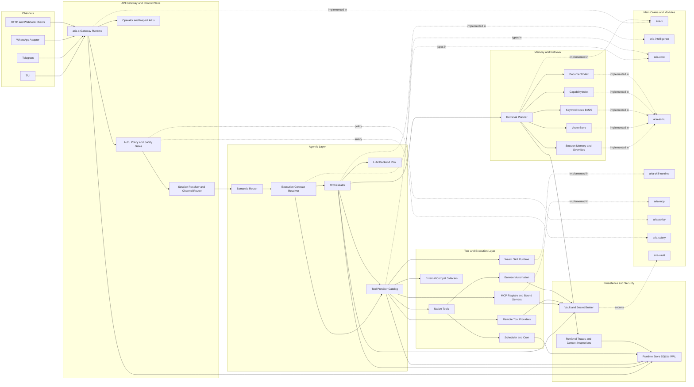

# Macro System Architecture

This view shows the top-level topology across channels, gateway runtime, orchestration, retrieval, execution backends, persistence, and crate boundaries.

```mermaid
graph LR
  subgraph Channels["Channels"]
    TUI["TUI"]
    TG["Telegram"]
    WA["WhatsApp Adapter"]
    WEB["HTTP and Webhook Clients"]
  end

  subgraph Gateway["API Gateway and Control Plane"]
    API["aria-x Gateway Runtime"]
    AUTH["Auth, Policy and Safety Gates"]
    ROUTE["Session Resolver and Channel Router"]
    INSPECT["Operator and Inspect APIs"]
  end

  subgraph Agentic["Agentic Layer"]
    SEM["Semantic Router"]
    CONTRACT["Execution Contract Resolver"]
    ORCH["Orchestrator"]
    TOOLCAT["Tool Provider Catalog"]
    LLMPOOL["LLM Backend Pool"]
  end

  subgraph Execution["Tool and Execution Layer"]
    NATIVE["Native Tools"]
    WASM["Wasm Skill Runtime"]
    MCP["MCP Registry and Bound Servers"]
    COMPAT["External Compat Sidecars"]
    REMOTE["Remote Tool Providers"]
    BROWSER["Browser Automation"]
    SCHED["Scheduler and Cron"]
  end

  subgraph Retrieval["Memory and Retrieval"]
    SESS["Session Memory and Overrides"]
    RPLAN["Retrieval Planner"]
    VEC["VectorStore"]
    BM25["Keyword Index BM25"]
    CAP["CapabilityIndex"]
    DOC["DocumentIndex"]
  end

  subgraph Data["Persistence and Security"]
    STORE["Runtime Store SQLite WAL"]
    VAULT["Vault and Secret Broker"]
    AUDIT["Retrieval Traces and Context Inspections"]
  end

  subgraph Crates["Main Crates and Modules"]
    CX["aria-x"]
    CINT["aria-intelligence"]
    CCORE["aria-core"]
    CSSMU["aria-ssmu"]
    CSKILL["aria-skill-runtime"]
    CMCP["aria-mcp"]
    CPOL["aria-policy"]
    CSAFE["aria-safety"]
    CVAULT["aria-vault"]
  end

  TUI --> API
  TG --> API
  WA --> API
  WEB --> API

  API --> AUTH --> ROUTE --> SEM --> CONTRACT --> ORCH
  API --> INSPECT

  CONTRACT --> TOOLCAT
  ORCH --> LLMPOOL
  ORCH --> TOOLCAT
  ORCH --> RPLAN

  TOOLCAT --> NATIVE
  TOOLCAT --> WASM
  TOOLCAT --> MCP
  TOOLCAT --> COMPAT
  TOOLCAT --> REMOTE
  NATIVE --> BROWSER
  NATIVE --> SCHED

  RPLAN --> SESS
  RPLAN --> VEC
  RPLAN --> BM25
  RPLAN --> CAP
  RPLAN --> DOC

  API --> STORE
  ORCH --> STORE
  TOOLCAT --> STORE
  SCHED --> STORE
  RPLAN --> AUDIT --> STORE
  ORCH --> VAULT
  MCP --> VAULT
  REMOTE --> VAULT
  BROWSER --> VAULT

  API -. implemented in .-> CX
  ORCH -. implemented in .-> CINT
  CONTRACT -. types in .-> CCORE
  TOOLCAT -. types in .-> CCORE
  RPLAN -. implemented in .-> CX
  SESS -. implemented in .-> CSSMU
  VEC -. implemented in .-> CSSMU
  BM25 -. implemented in .-> CSSMU
  CAP -. implemented in .-> CSSMU
  DOC -. implemented in .-> CSSMU
  WASM -. implemented in .-> CSKILL
  MCP -. implemented in .-> CMCP
  AUTH -. policy .-> CPOL
  AUTH -. safety .-> CSAFE
  VAULT -. secrets .-> CVAULT
```
