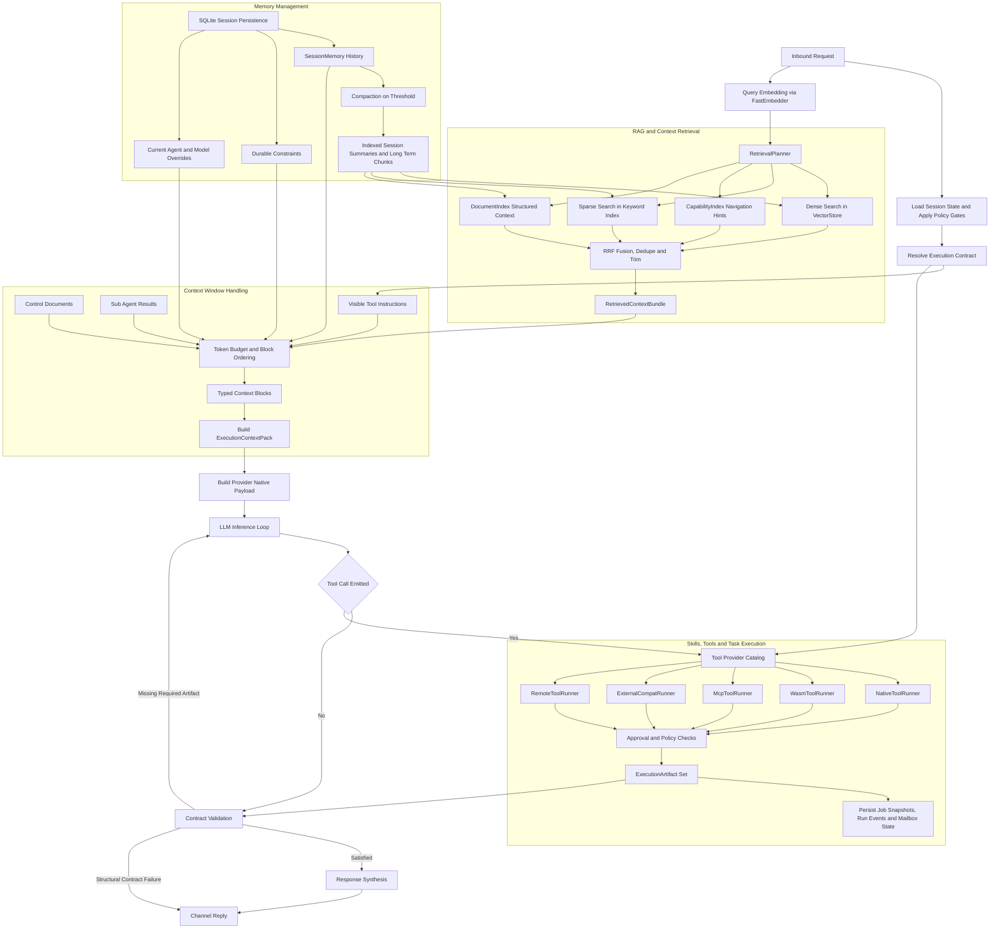

# Agent Internals and Memory Management

This view maps the agent loop, retrieval assembly, context packing, tool execution, artifact validation, and memory compaction and persistence.

```mermaid
graph TD
  R0["Inbound Request"]
  R1["Load Session State and Apply Policy Gates"]
  R2["Resolve Execution Contract"]
  R3["Query Embedding via FastEmbedder"]
  R5["Build ExecutionContextPack"]
  R6["Build Provider Native Payload"]
  R7["LLM Inference Loop"]
  R8{"Tool Call Emitted"}
  R10["ExecutionArtifact Set"]
  R11["Contract Validation"]
  R12["Response Synthesis"]
  R13["Channel Reply"]

  subgraph Memory["Memory Management"]
    M1["SessionMemory History"]
    M2["Durable Constraints"]
    M3["Current Agent and Model Overrides"]
    M4["Compaction on Threshold"]
    M5["SQLite Session Persistence"]
    M6["Indexed Session Summaries and Long Term Chunks"]
    M5 --> M1
    M5 --> M2
    M5 --> M3
    M1 --> M4 --> M6
  end

  subgraph Retrieval["RAG and Context Retrieval"]
    Q0["RetrievalPlanner"]
    Q1["Dense Search in VectorStore"]
    Q2["Sparse Search in Keyword Index"]
    Q3["CapabilityIndex Navigation Hints"]
    Q4["DocumentIndex Structured Context"]
    Q5["RRF Fusion, Dedupe and Trim"]
    Q6["RetrievedContextBundle"]
    Q0 --> Q1
    Q0 --> Q2
    Q0 --> Q3
    Q0 --> Q4
    Q1 --> Q5
    Q2 --> Q5
    Q3 --> Q5
    Q4 --> Q5
    Q5 --> Q6
  end

  subgraph Context["Context Window Handling"]
    C1["Control Documents"]
    C2["Sub Agent Results"]
    C3["Visible Tool Instructions"]
    C4["Token Budget and Block Ordering"]
    C5["Typed Context Blocks"]
    Q6 --> C4
    M1 --> C4
    M2 --> C4
    M3 --> C4
    C1 --> C4
    C2 --> C4
    C3 --> C4
    C4 --> C5 --> R5
  end

  subgraph Tools["Skills, Tools and Task Execution"]
    T1["Tool Provider Catalog"]
    T2["NativeToolRunner"]
    T3["WasmToolRunner"]
    T4["McpToolRunner"]
    T5["ExternalCompatRunner"]
    T6["RemoteToolRunner"]
    T7["Approval and Policy Checks"]
    T8["Persist Job Snapshots, Run Events and Mailbox State"]
    T1 --> T2 --> T7
    T1 --> T3 --> T7
    T1 --> T4 --> T7
    T1 --> T5 --> T7
    T1 --> T6 --> T7
    T7 --> R10
    R10 --> T8
  end

  R0 --> R1 --> R2
  R0 --> R3 --> Q0
  M6 --> Q1
  M6 --> Q2
  M6 --> Q4
  R2 --> C3
  R2 --> T1
  R5 --> R6 --> R7 --> R8
  R8 -->|No| R11
  R8 -->|Yes| T1
  R10 --> R11
  R11 -->|Satisfied| R12 --> R13
  R11 -->|Missing Required Artifact| R7
  R11 -->|Structural Contract Failure| R13
```
