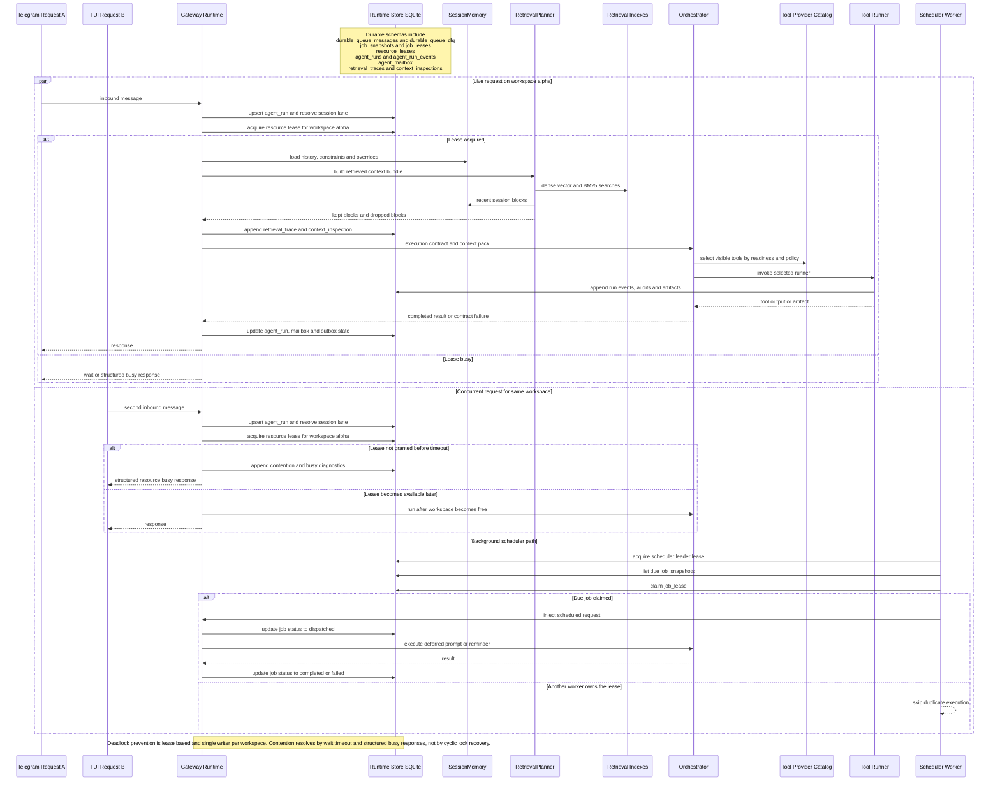

# Data Flow, Schemas and Concurrency

This view focuses on concurrent request handling, leases, scheduler coordination, retrieval tracing, and durable state transitions.

```mermaid
sequenceDiagram
    participant U1 as Telegram Request A
    participant U2 as TUI Request B
    participant GW as Gateway Runtime
    participant Store as Runtime Store SQLite
    participant Mem as SessionMemory
    participant Ret as RetrievalPlanner
    participant Idx as Retrieval Indexes
    participant Orch as Orchestrator
    participant Cat as Tool Provider Catalog
    participant Run as Tool Runner
    participant Sch as Scheduler Worker

    Note over Store: Durable schemas include<br/>durable_queue_messages and durable_queue_dlq<br/>job_snapshots and job_leases<br/>resource_leases<br/>agent_runs and agent_run_events<br/>agent_mailbox<br/>retrieval_traces and context_inspections

    par Live request on workspace alpha
        U1->>GW: inbound message
        GW->>Store: upsert agent_run and resolve session lane
        GW->>Store: acquire resource lease for workspace alpha
        alt Lease acquired
            GW->>Mem: load history, constraints and overrides
            GW->>Ret: build retrieved context bundle
            Ret->>Idx: dense vector and BM25 searches
            Ret->>Mem: recent session blocks
            Ret-->>GW: kept blocks and dropped blocks
            GW->>Store: append retrieval_trace and context_inspection
            GW->>Orch: execution contract and context pack
            Orch->>Cat: select visible tools by readiness and policy
            Orch->>Run: invoke selected runner
            Run->>Store: append run events, audits and artifacts
            Run-->>Orch: tool output or artifact
            Orch-->>GW: completed result or contract failure
            GW->>Store: update agent_run, mailbox and outbox state
            GW-->>U1: response
        else Lease busy
            GW-->>U1: wait or structured busy response
        end
    and Concurrent request for same workspace
        U2->>GW: second inbound message
        GW->>Store: upsert agent_run and resolve session lane
        GW->>Store: acquire resource lease for workspace alpha
        alt Lease not granted before timeout
            GW->>Store: append contention and busy diagnostics
            GW-->>U2: structured resource busy response
        else Lease becomes available later
            GW->>Orch: run after workspace becomes free
            GW-->>U2: response
        end
    and Background scheduler path
        Sch->>Store: acquire scheduler leader lease
        Sch->>Store: list due job_snapshots
        Sch->>Store: claim job_lease
        alt Due job claimed
            Sch->>GW: inject scheduled request
            GW->>Store: update job status to dispatched
            GW->>Orch: execute deferred prompt or reminder
            Orch-->>GW: result
            GW->>Store: update job status to completed or failed
        else Another worker owns the lease
            Sch-->>Sch: skip duplicate execution
        end
    end

    Note over GW,Store: Deadlock prevention is lease based and single writer per workspace. Contention resolves by wait timeout and structured busy responses, not by cyclic lock recovery.
```
