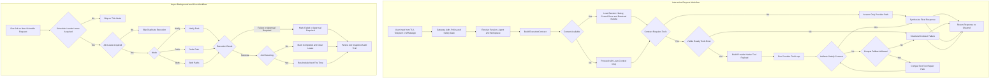

# Decision Trees and Workflows

This view separates interactive request branching from asynchronous scheduled execution.

```mermaid
graph TD
  subgraph Interactive["Interactive Request Workflow"]
    I0["User Input from TUI, Telegram or WhatsApp"]
    I1["Gateway Auth, Policy and Safety Gate"]
    I2["Resolve Session, Agent and Workspace"]
    I3["Build ExecutionContract"]
    I4{"Context Available"}
    I5["Load Session History, Control Docs and Retrieval Bundle"]
    I6["Proceed with Lean Context Only"]
    I7{"Contract Requires Tools"}
    I8["Answer Only Provider Path"]
    I9{"Visible Ready Tools Exist"}
    I10["Build Provider Native Tool Payload"]
    I11["Run Provider Tool Loop"]
    I12{"Artifacts Satisfy Contract"}
    I13["Synthesize Final Response"]
    I14["Structural Contract Failure"]
    I15{"Compat Fallback Allowed"}
    I16["Compat Text Tool Repair Path"]
    I17["Return Response to Channel"]

    I0 --> I1 --> I2 --> I3 --> I4
    I4 -->|Yes| I5 --> I7
    I4 -->|No| I6 --> I7
    I7 -->|No| I8 --> I13 --> I17
    I7 -->|Yes| I9
    I9 -->|No| I14 --> I17
    I9 -->|Yes| I10 --> I11 --> I12
    I12 -->|Yes| I13 --> I17
    I12 -->|No| I15
    I15 -->|Yes| I16 --> I12
    I15 -->|No| I14 --> I17
  end

  subgraph Async["Async Background and Cron Workflow"]
    C0["Due Job or New Schedule Request"]
    C1{"Scheduler Leader Lease Acquired"}
    C2["Skip on This Node"]
    C3{"Job Lease Acquired"}
    C4["Skip Duplicate Execution"]
    C5{"Mode"}
    C6["Notify Path"]
    C7["Defer Path"]
    C8["Both Paths"]
    C9{"Execution Result"}
    C10{"Job Recurring"}
    C11["Mark Completed and Clear Lease"]
    C12["Reschedule Next Fire Time"]
    C13["Mark Failed or Approval Required"]
    C14["Persist Job Snapshot Audit Trail"]

    C0 --> C1
    C1 -->|No| C2
    C1 -->|Yes| C3
    C3 -->|No| C4
    C3 -->|Yes| C5
    C5 -->|Notify| C6 --> C9
    C5 -->|Defer| C7 --> C9
    C5 -->|Both| C8 --> C9
    C9 -->|Success| C10
    C9 -->|Failure or Approval Required| C13 --> C14
    C10 -->|No| C11 --> C14
    C10 -->|Yes| C12 --> C14
  end
```
